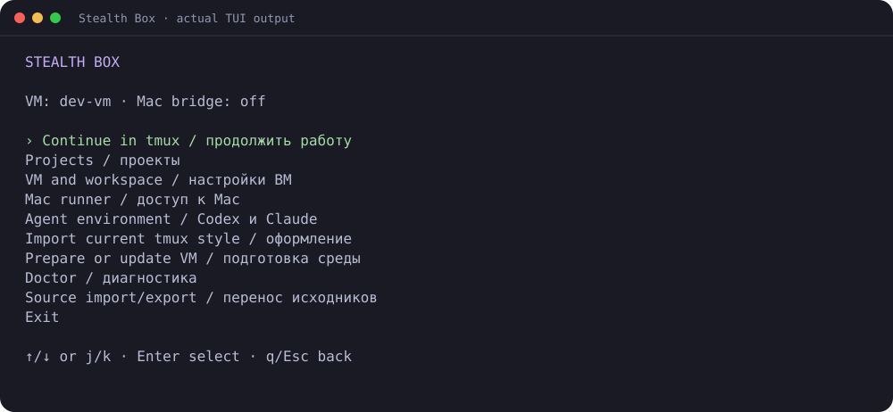
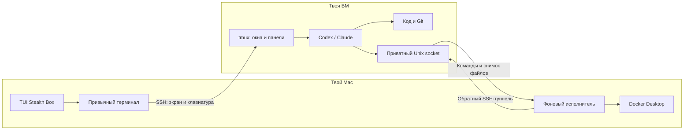
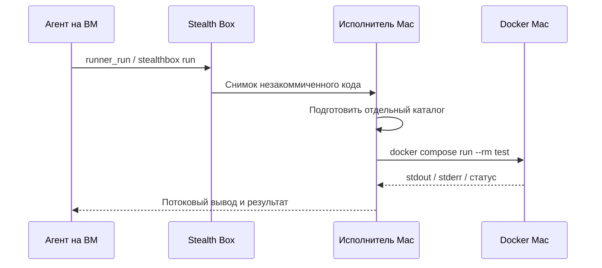

# Stealth Box

**Привычный терминал. tmux и агенты на ВМ. Docker — на ВМ или твоём Mac.**

Stealth Box открывает рабочие сессии, подключает исполнителя на Mac и даёт агенту
MCP-инструменты для команд. Написан на Go. После первой настройки — `stealthbox`.



## Что ты увидишь

```text
Твой терминал на Mac
┌─────────────────────────────────────────────────────────────────────┐
│ agent-hub · codex · mac  1 │ pagent · codex · vm  2 │ claude · vm  3 │
├─────────────────────────────────────────────────────────────────────┤
│ › Проверь изменения и запусти тесты.                                │
│                                                                   │
│ • Прогон на Mac: код с ВМ → отдельный каталог → Docker → результат. │
│                                                                   │
│ › Следующий запрос…                                               │
└─────────────────────────────────────────────────────────────────────┘
```

Это иллюстрация. **tmux, агент, Git и основной код действительно работают на ВМ.**
Mac отображает терминал и при необходимости выполняет прогоны. Интерфейсы Codex
и Claude остаются родными.



## Быстрый старт

### 1. Установи на Mac

```sh
go install github.com/mcoder33/stealthbox/cmd/stealthbox@latest
```

Нужен Go 1.24+. Добавь `$(go env GOPATH)/bin` в `PATH`. Без Go скачай бинарник
своей платформы из [Releases](https://github.com/mcoder33/stealthbox/releases/latest),
проверь по `checksums.txt`, сделай исполняемым и помести в свой `PATH`.
Поддерживаются **macOS/Linux, ARM64/AMD64**; Windows пока не поддерживается.

### 2. Подготовь ВМ

На ВМ нужны SSH, tmux, проект и установленный/авторизованный агент. Stealth Box
не копирует учётные данные Codex/Claude и не устанавливает Docker или агентов.

Пример `~/.ssh/config` на Mac:

```sshconfig
Host dev-vm
    HostName YOUR_VM_IP
    User developer
    IdentityFile ~/.ssh/id_ed25519
    IdentitiesOnly yes
```

Сначала проверь `ssh dev-vm` и ключ сервера. Для автоматических подключений ключ
должен быть доступен через ssh-agent/keychain. Программа не хранит SSH-пароли,
не отключает проверку ключа сервера и не включает agent forwarding.

### 3. Настрой через TUI

```sh
stealthbox
```

| Пункт | Настройки |
|---|---|
| **VM and workspace** | SSH-алиас и имя рабочего tmux |
| **Projects** | Путь проекта на ВМ, отдельный каталог Mac, агент и исполнитель по умолчанию |
| **Mac runner** | Мост, прямые команды, таймаут; запуск/остановка/статус моста |
| **Agents** | Команды запуска Codex, Claude, оболочки или своего агента |
| **Import current tmux style** | Эффективные опции и привязки локального tmux |
| **Deploy or update on VM** | Установка бинарника и конфигурации |
| **Doctor** | Проверки SSH, tmux, агентов, каталогов, Docker и моста |
| **Connect** | Проект → агент → исполнитель → имя экземпляра |

**↑/↓ или j/k** — навигация, **Enter** — выбор, **q/Esc** — назад.
Пустой ответ в редакторе поля сохраняет прежнее значение. Для прогонов на Mac
включи **Mac bridge**. **Direct Mac commands** дополнительно включает `mac_exec`.

### 4. Подключись

Открой привычный терминал **вне локального tmux**, чтобы не вкладывать tmux в tmux:

```sh
stealthbox connect --project agent-hub --agent codex --runner mac
```

Первое подключение определяет платформу/HOME ВМ, устанавливает Stealth Box,
отправляет конфигурацию, запускает фоновый мост Mac и открывает нужное окно tmux.
Обычные подключения используют установленный бинарник; обновление — `setup`.
Для установки берётся проверенный по SHA-256 бинарник релиза. Из checkout можно
собрать его Go, а для офлайн-установки указать `--binary`.

## Несколько вкладок и агентов

```text
stealthbox ← одна рабочая tmux-сессия на ВМ
├── agent-hub-codex-mac-main
├── pagent-codex-vm-main
├── agent-hub-claude-vm-review
└── agent-hub-codex-mac-second
```

```sh
# Второй экземпляр того же агента
stealthbox connect --project agent-hub --agent codex --runner mac --slot second
# Другой агент в отдельном окне
stealthbox connect --project agent-hub --agent claude --runner vm --slot review
# Обычная консоль без tmux
stealthbox open --project agent-hub --agent shell --session shell
# Аргументы агента
stealthbox connect --project agent-hub --agent codex -- resume --last
```

Окно определяется проектом, агентом, исполнителем и `slot`. Дополнительные
аргументы добавляют короткий хеш. Повторное подключение возвращает в существующий
процесс, а не заменяет его. Для новых настроек агента заверши старый процесс или
используй новый `slot`. Окно можно добавить из самой ВМ:

```sh
stealthbox workspace --project pagent --agent codex --runner vm --no-attach
```

tmux использует отдельный socket `-L stealthbox`; остальные сессии не меняются.

### Твоё оформление

Оставь обычный локальный tmux работающим и выполни `stealthbox theme` или выбери
импорт в TUI. Тема отправится на ВМ при следующем setup/подключении. Шрифты и
базовая палитра остаются настройками твоего терминала Mac.

Опции и привязки tmux экспортируются, но локальные `run-shell`-привязки,
плагинные `@`-опции и установка плагинов автоматически не переносятся. Плагины,
скрипты статуса и совместимую версию tmux нужно подготовить на ВМ отдельно.

## Docker и командный доступ к Mac

При запуске Codex/Claude получают временную MCP-конфигурацию. Постоянные настройки
агентов не переписываются; их собственные правила доверия/подтверждений сохраняются.

| Инструмент | Что делает |
|---|---|
| `runner_run` | Команда на выбранном исполнителе; для Mac сначала передаётся код |
| `vm_exec` | Явная команда на ВМ без синхронизации |
| `mac_exec` | Явная команда на Mac без замены файлов; при включённом `allow_exec` |

Агент получает описание окружения и правило использовать `runner_run` для Docker
и тестов. Произвольные `docker ...` в оболочке **не перехватываются**: они работают
там, где находится оболочка. Своим агентам подключай `stealthbox mcp` как stdio
MCP-сервер или добавь правило использовать CLI в инструкции проекта.



В сессии на ВМ переменные проекта/исполнителя уже заданы:

```sh
stealthbox run -- docker compose run --rm test
stealthbox run --runner vm -- docker compose run --rm test
stealthbox exec --on mac -- uname -s
stealthbox exec --on vm -- git status --short
# Скачать артефакт с Mac на ВМ; output не должен существовать
stealthbox fetch --file reports/result.json --output ./result.json
```

### Файлы и состояние

```text
ВМ: основной проект                  Mac: отдельная копия для прогонов
├── src/              ──────────→    ├── src/
├── compose.yaml      ──────────→    ├── compose.yaml
├── .git/             исключён       ├── .stealthbox-runner
└── .env              исключён       └── .env ← настраивается отдельно на Mac
```

- Каталог Mac должен быть **отдельным, изначально пустым**. Непустой каталог без
  метки не заменяется. Основной код редактируется на ВМ.
- Новый снимок заменяет код и удаляет устаревшие файлы. `.git`, `.env`, `.env.*`,
  `vendor`, `node_modules`, `.serena` исключены; существующие исключённые файлы
  исполнителя сохраняются. Это не универсальное обнаружение секретов.
- Символические ссылки и специальные файлы исходника не передаются. Архивы с
  выходом за каталог, ссылками и превышением лимита отклоняются.
- Второй одновременный прогон того же проекта получает `409 runner busy`.
  Для параллельных прогонов нужны разные каталоги/проекты.
- Артефакты скачивай до следующей синхронизации. Базы и Docker volumes остаются
  на исполнителе и не мигрируют при переключении. ARM64/AMD64 могут отличаться;
  при необходимости задавай платформу образов в Compose.

### Соединение с Mac

```text
Mac сам устанавливает исходящее SSH-соединение с ВМ
          └── -R remote/mac.sock:local/mac.sock
                    │                    │
             Агент на ВМ          Исполнитель на Mac
```

На Mac не нужен SSH-сервер, публичный IP или открытый HTTP/Docker-порт. Используются
Unix sockets, SSH и токен в конфигурациях с правами `0600`. На SSH-сервере ВМ нужно
разрешить Unix-socket forwarding.

Мост сохраняется после выхода из tmux:

```sh
stealthbox bridge-status
stealthbox bridge-stop
stealthbox bridge-start
stealthbox bridge           # foreground для диагностики
```

Лог: `~/.config/stealthbox/mac.sock.log`. Новые настройки применяются через
**Start / apply** в TUI или новое подключение. Перезапуск/остановка моста прерывает
команды Mac. После перезагрузки Mac нужно запустить программу снова.

**Команды имеют права пользователя Mac. Исполнитель не является security sandbox.**
Рабочий каталог не ограничивает файловые/сетевые права самой команды. `allow_exec`
управляет прямым инструментом; `runner_run` тоже исполняет произвольный код проекта.
Для изоляции используй отдельного пользователя или Linux-ВМ с Docker.
Управление окнами macOS, мышью, экраном и браузером здесь не реализовано.

## Отключения и порты

| Событие | Результат |
|---|---|
| Detach/закрытие терминала | Процессы ВМ и мост Mac остаются |
| Обрыв SSH | Терминал/мост переподключаются; команды автоматически не повторяются |
| Mac уснул/потерял сеть | Команды Mac недоступны; прерванный прогон проверяй вручную |
| ВМ остановлена/прервана | Процессы завершены; после старта нужна новая сессия/resume |

В `workspace` конфигурации можно указать:

```json
"forwards": [{"local": 8080, "remote": 8080}]
```

При подключении сервис ВМ станет доступен на Mac как `http://127.0.0.1:8080`.
Docker-порты Mac уже находятся на Mac. Порты контейнеров автоматически не обнаруживаются.

## CLI без TUI

```sh
stealthbox init --host dev-vm --enable-mac --allow-mac-exec
stealthbox project --project example \
  --path /home/developer/projects/example \
  --mac-path /Users/developer/.local/share/stealthbox/runners/example \
  --agent codex --runner mac
stealthbox theme
stealthbox setup
stealthbox connect --project example
```

Все флаги идут до `--` и аргументов команды. `--dry-run` не подключается и не пишет
файлы. `config` показывает настройки с замаскированным токеном, `config --edit`
открывает `$EDITOR`. Профиль — `~/.config/stealthbox/config.json`; альтернативы:
`--config` или `STEALTHBOX_CONFIG`. Один профиль соответствует одной ВМ.
`STEALTHBOX_SSH_CONFIG` задаёт отдельный файл SSH-алиасов для автоматизации/тестов.

## Проверка

```sh
stealthbox doctor
stealthbox bridge-status
make test                         # race detector + go vet
python3 tests/integration/tui.py   # реальный TUI через pseudo-terminal
make e2e                          # Docker, Compose, SSH, Python 3, Go
make release VERSION=v0.2.0
```

E2E использует временный Linux-контейнер с SSH/tmux и отдельный тестовый ключ.
Проверяются установка, туннель, настоящий локальный Docker, окна агентов, тема,
переподключение, мост после detach и скачивание артефакта. Ресурсы убираются после
теста. Агенты в E2E заменены оболочками: подписки и модельные вызовы не нужны.
CI проверяет Linux/macOS; E2E запускается на Linux. Также успешно выполнен
[прогон на временной ВМ Yandex Cloud Kazakhstan](docs/verification.md): Docker
на ВМ и Mac, обратный туннель, восстановление SSH и возврат артефактов.
Все созданные облачные ресурсы после теста удалены. Живые учётные записи агентов
и запросы к моделям проверяются отдельно после настройки доступа.

При аварийном завершении может остаться socket: сначала убедись, что его владелец
не работает, и удали только этот устаревший socket. Локальные sockets программа
вслепую не удаляет. Не направляй отмеченный каталог исполнителя на личные данные.

В `docs/presentation/` сохранены презентация и макет терминала этапа проектирования.
Они имитируют работу; актуальные возможности описаны выше.

MIT licensed.
