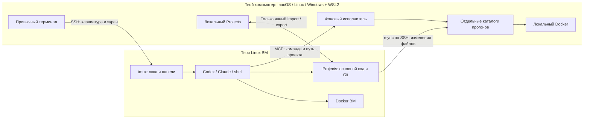
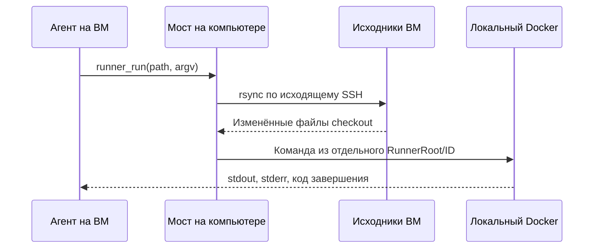

# Stealth Box

**Твой терминал и оформление. tmux, агенты и код — на ВМ. Docker — на ВМ или на твоём компьютере.**

Stealth Box — небольшая программа на Go. Она соединяет привычный терминал с ВМ,
сохраняет рабочие окна tmux и даёт агенту команды для прогонов на выбранной машине.
Можно открыть весь `~/Projects` и работать сразу с несколькими репозиториями.



## Как выглядит работа

Открываешь обычный терминал вне локального tmux и запускаешь:

```sh
stealthbox connect
```

Внутри — tmux на ВМ. Окна и панели работают обычными клавишами tmux:

```text
┌── tmux на ВМ · ~/Projects ────────────────────────────────────────────┐
│ Projects · shell · VM  1 │ Projects · Codex · local  2 │ Claude · VM  3│
├──────────────────────────────────────────────────────────────────────┤
│ developer@dev-vm:~/Projects$ codex                                   │
│                                                                    │
│ › В первом проекте исправь API, потом во втором обнови тесты.        │
│   Прогоны обоих проектов выполни в Docker на моём компьютере.        │
│                                                                    │
│ • runner_run: path=first-project, runner=local                       │
│   VM → rsync → отдельная локальная копия → Docker → результат       │
│ • runner_run: path=second-project, runner=local                      │
│   VM → другая локальная копия → Docker → результат                  │
│                                                                    │
│ › Следующая задача…                                                │
└──────────────────────────────────────────────────────────────────────┘
```

Это иллюстрация с укороченными названиями окон. Интерфейс Codex/Claude остаётся
родным; Stealth Box отвечает за подключение, сессии и исполнителей.
Агент на ВМ видит **весь настроенный Projects** и сам читает инструкции выбранного
репозитория. В каждом вызове инструмента он явно указывает путь проекта.

## Быстрый старт: весь Projects

### 1. Установка

На macOS/Linux с Go 1.24+:

```sh
go install github.com/mcoder33/stealthbox/cmd/stealthbox@latest
```

Добавь каталог `$(go env GOPATH)/bin` в `PATH`. Без Go скачай подходящий бинарник
из [Releases](https://github.com/mcoder33/stealthbox/releases/latest), проверь
`checksums.txt`, сделай исполняемым и помести в `PATH`.
Есть сборки **macOS, Linux и Windows × ARM64/AMD64**. Windows использует WSL2;
[настройка ниже](#windows-с-wsl2).

На локальной машине нужны `ssh`, `rsync` и работающий Docker для локальных прогонов.
На ВМ нужны SSH, `tmux`, `git`, `rsync`, установленный и авторизованный агент.
Docker на ВМ нужен только для прогонов там. Stealth Box не устанавливает агентов
и не переносит их учётные данные.

### 2. Подключение по SSH

Пример `~/.ssh/config` на локальной машине:

```sshconfig
Host dev-vm
    HostName YOUR_VM_IP
    User developer
    IdentityFile ~/.ssh/id_ed25519
    IdentitiesOnly yes
```

Сначала проверь `ssh dev-vm` и ключ сервера. Ключ должен быть доступен для
подключений без ввода пароля, например через ssh-agent/keychain.
Stealth Box не отключает проверку ключа сервера и не включает agent forwarding.

### 3. Три разных каталога

```text
ВМ                                        Твой компьютер
~/Projects/                 VMRoot        ~/Projects/        LocalRoot
├── first-project/.git/                    ├── first-project/.git/
└── second-project/.git/                   └── second-project/.git/
   ↑ агент редактирует здесь                 ↑ твои рабочие копии

                                          ~/.local/share/stealthbox/runners/
                                          ├── <checkout-id>/   RunnerRoot
                                          └── <other-id>/
                                             ↑ только копии для прогонов
```

**VMRoot — основной код. LocalRoot — твои локальные исходники для явного переноса.
RunnerRoot — отдельные каталоги для Docker.** Рабочие локальные репозитории
автоматически не заменяются. Каталоги исходников и прогонов не должны пересекаться.

```sh
stealthbox init --host dev-vm --enable-mac \
  --vm-root '~/Projects' \
  --local-root "$HOME/Projects" \
  --runner-root "$HOME/.local/share/stealthbox/runners" \
  --sync-transport auto --shell-integration

# Необязательно: импортировать оформление работающего локального tmux
stealthbox theme

# Определить HOME ВМ, установить бинарник/конфигурацию и создать VMRoot
stealthbox setup
stealthbox connect
```

`'~/Projects'` в `--vm-root` раскрывается **на ВМ** во время setup.
Локальные `~` раскрываются на твоём компьютере. Настройки уже существующего профиля:

```sh
stealthbox config --vm-root '~/Projects' --local-root ~/Projects \
  --runner-root ~/.local/share/stealthbox/runners --shell-integration
stealthbox setup
```

Клонируй нужные репозитории на ВМ обычным Git. Setup создаёт корень, но не клонирует
проекты. Одна конфигурация соответствует одной ВМ.

### 4. Запуск агента и прогонов

В открывшемся терминале на ВМ:

```sh
cd ~/Projects
codex                     # функция из управляемой оболочки, если включена интеграция
# Или явно, без функций:
stealthbox agent codex --runner local -- resume --last
stealthbox agent claude --path first-project --runner vm

# Обычные команды агента по-прежнему выполняются на ВМ.
# Для выбора машины прогона используем Stealth Box:
stealthbox run --path first-project --runner local -- docker compose run --rm test
stealthbox run --path second-project --runner vm -- docker compose run --rm test
stealthbox run --path team/repo/src --cwd tests --runner local -- make test
```

В последнем примере синхронизируется весь найденный checkout, а команда запускается
в его `tests`. У каждого checkout/worktree свой ID: одинаковые имена папок и
вложенные репозитории не смешивают локальные каталоги прогонов.
Если `--path` не указан, CLI на ВМ определяет проект по текущему каталогу.
Из самого корня Projects нужно выбрать путь: прогон всего дерева не подразумевается.

## TUI: настройки без редактора JSON

```sh
stealthbox                  # TUI, если запущено в терминале
stealthbox tui
```


| Пункт | Что настраивается |
|---|---|
| **VM and workspace** | SSH, имя tmux, режим Whole Projects, три корня, транспорт rsync/archive, функции codex/claude |
| **Connect** | Весь Projects или один проект → агент → исполнитель → tmux/shell → имя экземпляра |
| **Projects** | Дополнительные именованные проекты и их индивидуальные исполнители |
| **Mac runner** | Мост, прямые команды, таймаут, запуск/остановка/статус |
| **Agents** | Команды запуска Codex, Claude, shell и своих агентов |
| **Import current tmux style** | Эффективные опции и клавиши работающего локального tmux |
| **Deploy or update on VM** | Бинарник, конфигурация и тема на ВМ |
| **Source import/export** | Предпросмотр переноса исходников и явное применение плана |
| **Doctor** | SSH, каталоги, tmux, rsync, Git, агенты, Docker и мост |

**↑/↓ или j/k** — навигация; **Enter** — выбор; **q/Esc** — назад.
Пустой ответ в поле сохраняет прежнее значение. Изменения применяй через setup
или новое подключение; уже запущенный агент не перезапускается автоматически.

## Окна, панели и оформление

```sh
# На твоём компьютере: отдельные окна одного tmux на ВМ
stealthbox connect --agent codex --runner local --slot work
stealthbox connect --agent claude --path team/repo --runner vm --slot review
stealthbox connect --agent shell --session shell      # без tmux

# На ВМ: добавить окно, оставаясь внутри текущего tmux
stealthbox workspace --agent codex --runner local --slot second --no-attach
```

```text
Одна сессия tmux на ВМ
├── Projects / shell / VM
├── Projects / Codex / local / work
├── team/repo / Claude / VM / review
└── Projects / Codex / local / second
```

Окно определяется checkout/корнем, агентом, исполнителем, `slot` и аргументами
запуска. Повторное подключение возвращает в существующий процесс. Другой агент
получает своё окно. Обычные новые окна/панели наследуют окружение Stealth Box.
Функции codex/claude существуют только в управляемой оболочке и не меняют твои
`.bashrc`/`.zshrc`. Для других shell можно всегда использовать `stealthbox agent`.

tmux использует отдельный socket `-L stealthbox`. Шрифт и палитра терминала
остаются локальными. `stealthbox theme` переносит опции и клавиши, но установка
плагинов, `run-shell`-привязки и локальные скрипты статуса требуют подготовки на ВМ.
Подключайся из терминала вне локального tmux, чтобы не вкладывать два tmux.

## Как агент выбирает проект и машину

Codex/Claude получают MCP-конфигурацию только для конкретного запуска.
Их постоянные настройки не переписываются.

| Инструмент | Назначение |
|---|---|
| `projects_list` | Найти Git checkout/worktree под VMRoot |
| `runner_run` | Синхронизировать выбранный проект при необходимости и запустить команду на local/VM |
| `vm_exec` | Явная команда в выбранном checkout на ВМ без синхронизации |
| `local_exec` / `mac_exec` | Явная команда на локальной машине; только при включённом `allow_exec` |

Пример вызова для агента, работающего сразу с несколькими проектами:

```json
{"path":"team/repo","runner":"local","argv":["docker","compose","run","--rm","test"]}
```

`path` задаётся **в каждом вызове**. MCP не отслеживает `cd` внутри дочерних
shell-команд агента. Путь может быть относительным к VMRoot или абсолютным внутри
него; `cwd` — каталог команды относительно найденного checkout.
Именованные сессии с `--project NAME` сохраняют прежнюю привязку к одному проекту.
Агент сам читает `AGENTS.md` выбранного репозитория.

Произвольный `docker ...` в shell не перенаправляется: он выполняется на ВМ.
Для прозрачного выбора исполнителя агент должен использовать `runner_run` или
`stealthbox run`. Своим агентам можно подключить `stealthbox mcp` как stdio-сервер.



`auto` выбирает rsync, когда локальный мост знает SSH-алиас источника.
`archive` оставляет передачу снимка через туннель для прежних/автономных настроек.
На Mac не нужны SSH-сервер, публичный IP и открытый Docker/HTTP-порт.
Мост сам поддерживает обратный SSH-туннель к приватному Unix socket ВМ.

## rsync исходников: только по явному запросу

Перенос **LocalRoot ↔ VMRoot** отделён от автоматического обновления RunnerRoot.
Чтобы занести незакоммиченные локальные изменения в уже клонированный репозиторий:

```sh
# На твоём компьютере: только создать и посмотреть план
stealthbox source import --path team/repo --plan /tmp/import-repo.json

# После просмотра JSON: применить, если обе стороны ещё совпадают с планом
stealthbox source apply --plan /tmp/import-repo.json

# Забрать изменения ВМ в локальную рабочую копию
stealthbox source export --path team/repo --plan /tmp/export-repo.json
stealthbox source apply --plan /tmp/export-repo.json
```

```text
preview: сравнить SHA-256 файлов → показать add/update → сохранить план
         исходники с обеих сторон остаются неизменными

apply:   заново проверить обе стороны
         ├── совпадают → rsync
         └── изменились → конфликт, ничего не применять; создать новый план
```

План храни вне переносимого checkout. Обычный перенос сохраняет файлы,
существующие только у получателя. Удаление включается явно через `--delete` при
создании плана и попадает в предпросмотр. Во время apply не редактируй обе копии:
это защита от устаревшего плана, а не распределённая блокировка редакторов.

`.git`, `.env*`, `vendor`, `node_modules`, `.serena` и каталоги конфигураций агентов
исключены и сохраняются у получателя. Перенос не создаёт полноценный Git clone:
для истории/веток сначала клонируй репозиторий на ВМ обычным Git. Без `.git` проект
может работать как обычная папка. Source import/export отказывается от ссылок и
специальных файлов. Фильтры исключают известные пути; учётные данные, записанные
внутри произвольного исходника или конфигурации, автоматически не обнаруживаются.

## Копии прогонов, зависимости и артефакты

| Данные | Поведение |
|---|---|
| Незакоммиченный код ВМ | Передаётся в отдельный локальный checkout перед прогоном |
| Старые файлы кода RunnerRoot | Удаляются при следующей синхронизации |
| `.git`, `.env*`, `vendor`, `node_modules`, конфигурации агентов | Не копируются; существующие локальные зависимости/настройки сохраняются |
| Docker volumes / базы | Остаются на выбранном исполнителе |
| Артефакты | Доступны для fetch до следующей синхронизации |

Каталог прогонов должен быть отдельным. Непустой каталог без метки
`.stealthbox-runner` не заменяется. Два одновременных прогона одного checkout
получают `409 runner busy`; разные checkout могут выполняться параллельно.
Bind mounts Docker относятся к файловой системе исполнителя, поэтому сначала
код оказывается именно там, где работает Docker.

```sh
# После прогона: скачать локальный артефакт на ВМ, output должен быть новым
stealthbox fetch --path team/repo --file reports/result.xml --output ./result.xml
# Прямые команды на твоём компьютере — если разрешено в настройках
stealthbox exec --on local --path team/repo -- uname -s
```

ARM64/AMD64 могут отличаться: при необходимости указывай платформу образа в Compose.
Зависимости и тестовые конфигурации исполнителя подготавливаются отдельно.

## Соединение, права и диагностика

```sh
stealthbox bridge-status
stealthbox bridge-stop
stealthbox bridge-start
stealthbox bridge            # foreground, для диагностики
stealthbox doctor
```

Мост работает в фоне; настройки включают Unix socket и токен с правами `0600`.
SSH-сервер ВМ должен разрешать Unix-socket forwarding. Лог по умолчанию:
`~/.config/stealthbox/mac.sock.log`.

| Событие | Что произойдёт |
|---|---|
| Detach / закрыт терминал | tmux, агент на ВМ и локальный мост продолжают работу |
| Обрыв SSH | Подключение восстанавливается; команды не повторяются автоматически |
| Компьютер уснул/потерял сеть | Локальные прогоны недоступны; состояние прерванной команды проверяй вручную |
| ВМ остановлена или прервана облаком | Её процессы завершены; после старта нужна новая сессия/resume |
| Остановка/перезапуск моста | Локальные команды могут прерваться |

После перезагрузки компьютера запускай Stealth Box снова.
Прямые команды включаются отдельно: `config --edit` → `bridge.allow_exec: true`
или **Mac runner → Direct Mac commands** в TUI.

**Локальные команды выполняются с правами твоего пользователя. Это не OS sandbox.**
Рабочий каталог не ограничивает файловые/сетевые права запущенного кода. Это
касается и `runner_run`. Для изоляции используй отдельного пользователя или ВМ.
Управление мышью, экраном и браузером не реализовано.

Для сервисов ВМ в `workspace` можно настроить:

```json
"forwards": [{"local":8080,"remote":8080}]
```

Тогда при подключении порт доступен локально на `http://127.0.0.1:8080`.
Порты локального Docker уже находятся на твоём компьютере.

## Windows с WSL2

В PowerShell установи WSL2 с Ubuntu и создай Linux-пользователя:

```powershell
wsl --install -d Ubuntu
```

В Ubuntu:

```sh
sudo apt update
sudo apt install openssh-client rsync
```

Скачай `stealthbox-windows-amd64.exe` для x64 или `stealthbox-windows-arm64.exe`
для ARM64 из Releases. Проверь SHA-256, запусти в Windows Terminal:

```powershell
.\stealthbox-windows-amd64.exe
# Выбор другого установленного WSL-дистрибутива:
$env:STEALTHBOX_WSL_DISTRO = "Ubuntu"
```

Оба Linux-бинарника встроены в `.exe`; загрузка не нужна. SSH-ключи, `~/.ssh/config`,
LocalRoot, RunnerRoot и конфигурация Stealth Box находятся **в WSL**, а не в
Windows-профиле. `local` означает локальный WSL. Включи интеграцию Docker Desktop
с выбранным дистрибутивом и проверь `docker info` внутри него.
Программа не устанавливает WSL и не меняет системные права автоматически.
Полная справка: `stealthbox-windows-amd64.exe help --wsl`.

## Прежний режим одного проекта

Он продолжает работать без настройки VMRoot:

```sh
stealthbox init --host dev-vm --enable-mac
stealthbox project --project example --path /home/developer/example \
  --mac-path /Users/developer/.local/share/stealthbox/runners/example \
  --agent codex --runner mac
stealthbox setup
stealthbox connect --project example
```

`mac` остаётся совместимым именем исполнителя; в режиме Projects используй `local`.
Все флаги идут до `--` и аргументов команды. `--dry-run` не подключается и не пишет
файлы. `config` показывает токен замаскированным; `config --edit` открывает `$EDITOR`.
Конфигурация: `~/.config/stealthbox/config.json`, `--config` или `STEALTHBOX_CONFIG`.
`STEALTHBOX_SSH_CONFIG` задаёт отдельный файл SSH-алиасов, включая вызовы rsync.

## Проверки

```sh
make test                         # Go tests + race detector + go vet
python3 tests/integration/tui.py   # настоящий TUI через pseudo-terminal
make e2e                          # временный Linux SSH/tmux + локальный Docker
make release VERSION=v0.3.0        # шесть бинарников и checksums.txt
```

Режим Projects проверен на настоящем SSH/rsync и тяжёлом PHP/Yii2-проекте:
**4 набора Codeception, 1254 теста, 5503 assertions**; два теста уже отмечены
в исходном проекте как incomplete. Использованы отдельные тестовые базы и Docker,
артефакты возвращены на ВМ, кэш зависимостей сохранён между синхронизациями.
Прогон повторён с настоящей ВМ **Yandex Cloud Kazakhstan** как источником кода;
тяжёлые suite работали на Mac, на самой ВМ отдельно проверен Docker smoke.
[Подробности и границы проверки](docs/verification-v0.3.0.md).

Предыдущая версия также прошла
[проверку на временной ВМ Yandex Cloud Kazakhstan](docs/verification.md).
Созданные тогда облачные ресурсы удалены. Тестовые агенты проверяют запуск и MCP,
а реальные обращения к моделям требуют авторизации агента на твоей ВМ и проверяются
отдельно. Полная интерактивная работа Windows/WSL2 требует проверки на Windows;
CI проверяет сборку, встроенные payload и launcher.

В `docs/presentation/` сохранены презентация и макет терминала раннего этапа.
Актуальный рабочий сценарий описан в этом README.

MIT licensed.
