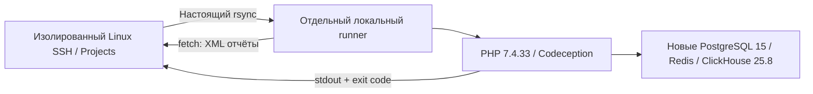

# Проверка режима Projects — 2 октября 2026

Проверен реальный путь **Linux-источник по SSH → rsync → локальный Docker →
возврат вывода и артефактов на Linux**. Источником служили и изолированный Linux
SSH-контейнер, и временная ВМ **Yandex Cloud Kazakhstan**. Это запуск проекта и тестов, а не макет
терминала и не подмена Docker тестовой программой.

## Тяжёлый проект

Для проверки использован Zadolbator, PHP/Yii2-проект с четырьмя наборами
Codeception. Рабочий checkout проекта не изменён. Тесты выполнялись на
Mac ARM64 с PHP-образом AMD64 через эмуляцию.

| Набор | Тесты | Assertions | Результат |
|---|---:|---:|---|
| common/unit | 1125 | 5225 | Без ошибок; 2 исходных теста отмечены incomplete |
| api (все настроенные suite: api + unit) | 105 | 239 | Успешно |
| frontend/api | 8 | 15 | Успешно |
| backend/unit | 16 | 24 | Успешно |
| **Всего** | **1254** | **5503** | **Без failed/error** |

Два incomplete относятся к исходным пометкам тестов MessageDelayCalculator;
они не объявлены пройденными. Это четыре набора тестов, а не все возможные
acceptance/functional сценарии приложения.

## Два реальных источника

| Источник кода и агента | Где работал Docker | Проверка |
|---|---|---|
| Linux SSH-контейнер | Mac | Все 4 набора, 1254 теста / 5503 assertions |
| ВМ Yandex Cloud Kazakhstan | Mac | Повтор всех 4 наборов с теми же числами; XML скачаны обратно на ВМ |
| ВМ Yandex Cloud Kazakhstan | Та же ВМ | Docker smoke на Alpine; тяжёлые PHP suite здесь не запускались |

На казахстанской ВМ также проверены корневой tmux, SSH/rsync и MCP-вызовы для
двух проектов **A → B → A** из одного workspace. XML-результаты проверены отдельно:
failed/error отсутствуют; два incomplete сохранились в common/unit.

## Изоляция и перенос

- Созданы отдельные тестовые PostgreSQL, Redis и ClickHouse в Docker-сети без
  опубликованных портов. Штатные контейнеры и сервисы пользователя не заменялись.
- Использованы тестовые конфигурации без рабочих учётных данных и фоновых
  обработчиков приложения. Исходная тестовая копия вручную очищена от рабочих
  учётных данных; безопасные конфигурации созданы заново. Для проверяемого
  DNS-имени задан fixture-адрес.
- Незакоммиченные файлы Linux-источника передавались через SSH/rsync в отдельный
  помеченный каталог. Исходники приложения не правились ради результата.
- `vendor` был подготовлен отдельно: его inode и время изменения сохранились
  после всех четырёх синхронизаций. Зависимости не передавались заново.
- Четыре XML-отчёта были скачаны инструментом fetch обратно на Linux-источник.

## Проверки Stealth Box

Go-проверки покрывают разрешение checkout/worktree, совпадающие имена папок,
выходы через пути/ссылки, отдельные ID, per-call MCP-пути и прежние именованные
проекты. Есть отдельные проверки:

- source preview без изменений исходников;
- настоящий rsync import/export;
- конфликт после редактирования файла с тем же размером и временем изменения;
- сохранение исключённых файлов, конфигураций агентов и dependency symlink;
- отказ от плана внутри переносимого checkout и от пересекающихся корней;
- передача аргументов оболочкой, наследование scope и запуск настоящего executable;
- пользовательские shell startup/alias/ZDOTDIR без изменения файлов пользователя.

Отдельный PTY-прогон проверяет настоящий TUI. Интеграционный стенд использует
SSH/tmux и реальный локальный Docker. [Проверка предыдущей версии на временной
ВМ Yandex Cloud Kazakhstan](verification.md) сохранена отдельно.

## Очистка

После облачного прогона удалены созданные тестом ВМ, её диск и отдельная security
group; отсутствие проверено списком ресурсов. Существующая инфраструктура
пользователя не удалялась. Использован только казахстанский регион.

## Границы результата

Для проверки интеграции запуска агентов используются test executables; запросы
к моделям Codex/Claude не выполнялись. Установку и авторизацию настоящего агента
пользователь завершает на своей ВМ. Проверка Windows в CI касается сборки,
payload и launcher; полная интерактивная WSL2-сессия требует машины Windows.

Эти результаты подтверждают перечисленные сценарии и четыре набора тестов проекта.
Они не означают, что любые команды проекта автоматически переедут между машинами,
что Docker volumes переносятся или что локальный исполнитель стал OS sandbox.
