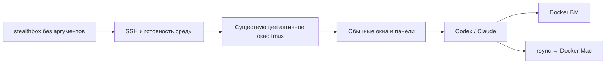

# Готовая среда tmux — 2 октября 2026

Проверен сценарий **один конфиг → `stealthbox` → обычный shell в tmux на ВМ**.
Настройка агента не требуется: в окнах запускаются обычные `codex` и `claude`.

## Автоматические проверки

- `go test -race ./...` и `go vet ./...` прошли.
- Минимальный конфиг без списка агентов дополняется путями, устойчивым ID и
  токеном; повторная загрузка сохраняет их.
- Повторная подготовка не переустанавливает существующие агенты. Offline-тест
  использует установщики-заглушки; настоящие установщики проверены отдельно на ВМ.
- Проверка темы выполняется в отдельном tmux: несовместимые команды не достигают
  рабочей сессии, переменные цветов сохраняются, стандартный layout соответствует
  версии tmux ВМ. Работающий процесс сохраняет PID.
- Настоящий TUI под PTY переживает серии SIGURG в меню и строке ввода без
  `interrupted system call`; Esc восстанавливает режим терминала.
- Интеграционные тесты с Linux SSH-контейнером и локальным Docker прошли:
  reconnect, фоновый мост, rsync, сохранение 1000 файлов зависимостей, worktree,
  одинаковые имена проектов, артефакты, source preview/apply и конфликты.
- Обычные новое окно и split pane запускают Codex/Claude через управляемый shell.
  Здесь запускатели тестовые: проверяются argv и MCP. Повторный запуск CLI без
  аргументов сохраняет активные окно, панель, PID и число окон.
- Собраны macOS/Linux/Windows для AMD64 и ARM64, включая Linux payload для WSL2.

## Настоящая ВМ Yandex Cloud Kazakhstan

Использована существующая пользовательская Ubuntu ВМ в Казахстане, без создания
новых облачных ресурсов. До обновления сохранены прежние бинарник и конфигурация.

| Проверка | Результат |
|---|---|
| Официальный установщик Codex | Установлен `codex-cli 0.160.0` |
| Официальный установщик Claude Code | Установлен `2.1.287` |
| Системные утилиты | Добавлены ripgrep и bubblewrap |
| Локальная тема → tmux 3.4 | Палитра и строка статуса работают; 19 несовместимых опций/клавиш пропущены с отчётом |
| `stealthbox` из домашнего каталога Mac, `TERM=xterm-ghostty` | Подключение прошло, описание терминала найдено, detach завершился с кодом 0 |
| Существующая пользовательская панель | Окно, панель и PID shell сохранились |
| Настоящие `codex --version` и `claude --version` в управляемом shell | Обе команды работают, в том числе после `cd ~` вне Projects |
| `runner_run` → Docker ВМ | Alpine Compose прочитал исходник с ВМ, smoke успешен |
| `runner_run` → rsync → Docker Mac | Тот же исходник передан в отдельный локальный runner, smoke успешен |
| Бинарник на ВМ | SHA-256 совпал с итоговой сборкой Linux/AMD64 |

Для smoke использовались отдельный временный проект, отдельный tmux server и
Compose networks. После проверки они и локальная копия прогонов удалены.
Пользовательская ВМ и её рабочая сессия сохранены.

## Границы проверки

Оба настоящих агента установлены, но на ВМ **ещё не выполнен вход в аккаунты**.
`codex login status` и `claude auth status` это подтвердили. Запросы к моделям
не выполнялись; авторизацию завершает пользователь через обычный интерфейс CLI.

Windows-сборки используют WSL2. Полный интерактивный сценарий на физической
Windows-машине здесь не проверялся. Zadolbator в этом цикле заново не прогонялся:
его предыдущая тяжёлая проверка описана в [отчёте v0.3.0](verification-v0.3.0.md).

Установка Docker на новой ВМ, перенос локальных shell-плагинов, конфигураций
агентов и самих репозиториев не входят в автоматическую подготовку.
