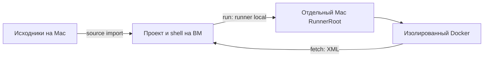

# Проверка Zadolbator через ВМ и Docker на Mac

Ниже проверяется цепочка ВМ → Mac RunnerRoot → PHP-тесты. Все контейнеры и базы
создаются отдельно, без открытых портов и доступа во внешнюю сеть. Рабочая копия
Zadolbator служит только источником кода и vendor; тесты запускаются в disposable
checkout. Это проверка PHP-наборов, запуск интерфейса в браузере сюда не входит.



1. **На Mac** запусти Docker Desktop и действующий мост Stealthbox. Для Mac runner
   нужны Docker Compose с `up --wait`, rsync, образ `zadolbator-app:latest`
   (`linux/amd64`, PHP 7.4) и установленный vendor в рабочей копии Zadolbator.
   Архитектуру helper проверяет по метаданным локального образа; Docker Desktop
   выбирает эмуляцию автоматически, без явного `platform` в Compose.
   Скрипт расположен в `/Users/coder33/Projects/itfinance/stealthbox/tools/`.
   Проверь образ: `docker image inspect zadolbator-app:latest`.
   Скрипт не собирает и не перезаписывает его автоматически.

   Перед импортом дополни `workspace` существующего конфига исключениями ниже.
   Это пример для LocalRoot/VMRoot с каталогом `itfinance/zadolbator`; не заменяй
   им весь конфиг. Пути буквальные, без glob; `.gitignore` не применяется.
   Файлы `.env*`, vendor и состояние агентов исключаются автоматически.

   ```json
   {
     "workspace": {
       "source_safe_links": true,
       "source_excludes": [
         "itfinance/zadolbator/common/config/main-local.php",
         "itfinance/zadolbator/common/config/params-local.php",
         "itfinance/zadolbator/common/config/test-local.php",
         "itfinance/zadolbator/common/config/codeception-local.php",
         "itfinance/zadolbator/console/config/main-local.php",
         "itfinance/zadolbator/console/config/params-local.php",
         "itfinance/zadolbator/console/config/test-local.php",
         "itfinance/zadolbator/api/config/main-local.php",
         "itfinance/zadolbator/api/config/params-local.php",
         "itfinance/zadolbator/api/config/test-local.php",
         "itfinance/zadolbator/api/config/codeception-local.php",
         "itfinance/zadolbator/backend/config/main-local.php",
         "itfinance/zadolbator/backend/config/params-local.php",
         "itfinance/zadolbator/backend/config/test-local.php",
         "itfinance/zadolbator/backend/config/codeception-local.php",
         "itfinance/zadolbator/frontend/config/main-local.php",
         "itfinance/zadolbator/frontend/config/params-local.php",
         "itfinance/zadolbator/frontend/config/test-local.php",
         "itfinance/zadolbator/frontend/config/codeception-local.php",
         "itfinance/zadolbator/tracker/config/main-local.php",
         "itfinance/zadolbator/tracker/config/params-local.php",
         "itfinance/zadolbator/tracker/config/test-local.php",
         "itfinance/zadolbator/tracker/config/codeception-local.php",
         "itfinance/zadolbator/common/runtime",
         "itfinance/zadolbator/console/runtime",
         "itfinance/zadolbator/api/runtime",
         "itfinance/zadolbator/backend/runtime",
         "itfinance/zadolbator/frontend/runtime",
         "itfinance/zadolbator/tracker/runtime",
         "itfinance/zadolbator/api/web/assets",
         "itfinance/zadolbator/backend/web/assets",
         "itfinance/zadolbator/frontend/web/assets",
         "itfinance/zadolbator/tracker/web/assets",
         "itfinance/zadolbator/api/web/index.php",
         "itfinance/zadolbator/api/web/index-test.php",
         "itfinance/zadolbator/backend/web/index.php",
         "itfinance/zadolbator/backend/web/index-test.php",
         "itfinance/zadolbator/frontend/web/index.php",
         "itfinance/zadolbator/frontend/web/index-test.php",
         "itfinance/zadolbator/tracker/web/index.php",
         "itfinance/zadolbator/yii",
         "itfinance/zadolbator/yii_test"
       ]
     }
   }
   ```

   Добавь известные локальные данные своего checkout в этот список, затем выполни
   штатный `stealthbox setup`, чтобы обновить Stealth Box на ВМ и развернуть конфиг.
   После этого выполни на Mac `stealthbox bridge-start`, затем
   `stealthbox bridge-status`: setup сам не перезапускает мост, а bridge-start
   применяет изменившийся конфиг. Если эти настройки уже применены, переходи к импорту.
   Не исключай отслеживаемый `common/config/db/components.php` и `environments`:
   helper восстановит локальные конфиги и entrypoints из этих
   шаблонов. `source_safe_links` сохраняет только допустимые внутренние ссылки;
   runner-синхронизация ссылки не переносит. После изменения исключений нужен
   новый план импорта.

2. **На Mac** подготовь импорт только целевого репозитория:
   `stealthbox source import --path itfinance/zadolbator --plan /tmp/zadolbator-import.json`.
   Просмотри план и его исключения. Не выбирай весь `itfinance`: соседние проекты
   не нужны для тестов и могут превысить свободное место ВМ. План не должен
   содержать `.env*`, vendor, реальные `<module>/config/*-local.php`, runtime
   и web/assets. Одноимённые `environments/.../*-local.php` — отслеживаемые
   шаблоны; они нужны и должны переноситься вместе с каталогами
   `environments/dev`, `prod`, `prod-tracker`, `stage`.

3. **На Mac** примени просмотренный план:
   `stealthbox source apply --plan /tmp/zadolbator-import.json`.
   При конфликте состояния создай новый план и проверь его перед повторным apply.

4. **На ВМ** перейди в импортированную папку:
   `cd ~/Projects/itfinance/zadolbator`.
   Затем выполни `test -e .git || git init`: импорт исключает `.git`, а эта команда
   обозначает границу репозитория для выбора именно `itfinance/zadolbator`.
   История Git при этом не появляется; для обычной разработки клонируй настоящий
   репозиторий на ВМ вместо использования копии только с исходниками.
   Все следующие команды `run` и `fetch` выполняй здесь. Для helper нужно, чтобы
   RunnerRoot на Mac был стандартным `~/.local/share/stealthbox/runners`;
   служебная `.stealthbox-qa` должна сохраняться при повторных синхронизациях.

5. **На ВМ** подготовь отдельный стек и базы:
   `stealthbox run --runner local -- bash /Users/coder33/Projects/itfinance/stealthbox/tools/zadolbator-qa.sh prepare`.
   Команда покажет путь Mac checkout и уникальное имя Compose-проекта. Первый
   запуск скопирует только vendor, поднимет PostgreSQL 15 / Redis 6.2.16 /
   ClickHouse 25.8, выполнит Development init и миграции `yii` и `yii_test`.
   Для тестов дат подготовит пустую ClickHouse-таблицу в базе `qa`: её DDL
   извлекается из одной миграции выбранного checkout и строго проверяется.
   Схема хранится только внутри `.stealthbox-qa`; полные CH-миграции и внешние
   Kafka/ETL-источники не запускаются.
   Подготовка повторяемая; журналы лежат в `.stealthbox-qa/reports/prepare.log`.

6. **На ВМ** запусти основной набор:
   `stealthbox run --runner local -- bash /Users/coder33/Projects/itfinance/stealthbox/tools/zadolbator-qa.sh common`.

7. **На ВМ** по очереди запусти остальные наборы, заменяя последний аргумент:
   `stealthbox run --runner local -- bash /Users/coder33/Projects/itfinance/stealthbox/tools/zadolbator-qa.sh api`,
   затем ту же команду с `frontend` и `backend`. Каждый прогон возвращает код
   завершения Codeception. `incomplete/skipped` оценивай отдельно от passed.

8. **На ВМ** скачай отчёт до следующего изменения исходников:
   `stealthbox fetch --path itfinance/zadolbator --file .stealthbox-qa/reports/common.xml --output /tmp/zadolbator-common.xml`.
   Output должен быть новым файлом. Аналогично скачай `api.xml`, `frontend.xml`,
   `backend.xml` и при необходимости одноимённые `.log`.
   При падении regular `*.fail.html` также сохраняются в этом закрытом каталоге;
   их можно скачать тем же `fetch` с точным именем файла из тестового вывода.

9. **На ВМ** проверь только свой стек:
   `stealthbox run --runner local -- bash /Users/coder33/Projects/itfinance/stealthbox/tools/zadolbator-qa.sh status`.
   При ошибке подготовки изучи `prepare.log`; при отсутствующих шаблонах повтори
   импорт. Не копируй настоящую `.env.example` или рабочие локальные конфиги.

10. **На ВМ** удали только тестовые контейнеры и их тома:
    `stealthbox run --runner local -- bash /Users/coder33/Projects/itfinance/stealthbox/tools/zadolbator-qa.sh down`.
    После прерванного Docker-прогона также выполни `down`. Код, vendor и отчёты
    остаются; следующий `prepare` создаст свежие базы. Если осталась блокировка,
    сначала убедись на Mac, что helper больше не работает, затем удали только
    пустую `.stealthbox-qa/lock` командой `rmdir` в указанном disposable checkout.

Helper использует только фиктивные подключения из `tools/zadolbator-qa/dummy.env`:
PostgreSQL `pgsql` с базами `sms-service` / `sms-service_test`, Redis `redis`,
ClickHouse `clickhouse` с базой `qa`; пользователь `qa`, пароль `qa-only-not-secret`.
Файл `.env` из проекта не используется. DNS fixture `dns.quad9.net` получает
адрес `9.9.9.9`; внешнее соединение из внутренней сети Docker недоступно.

Если cache или image находятся иначе, передай переменные именно Mac-процессу:
`stealthbox run --runner local -- env ZADOLBATOR_QA_IMAGE=my-qa:latest ZADOLBATOR_QA_VENDOR_SOURCE=/absolute/path/vendor bash /Users/coder33/Projects/itfinance/stealthbox/tools/zadolbator-qa.sh prepare`.
